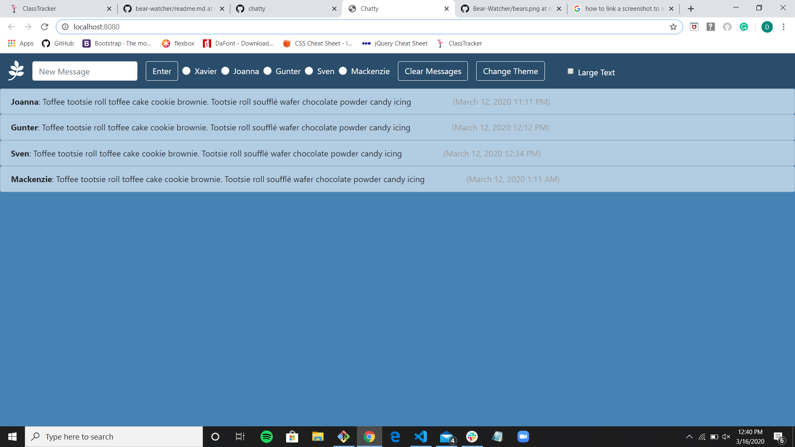

# chatty-waterwheels
chatty-waterwheels created by GitHub Classroom

## Technologies Used:
HTML5, SCSS, Javascript, Jquery, Webpack, EsLint, Bootstrap, Font Awesome

## Description:
NSS group project

Design a group chat application that allows users to message each other. Those users must select their name from the options diplayed on the top of the page before entering text into the message box. 

## Exercise Requirements:
The application has to include a navbar with buttons to select a users name, an input button to send text, a clear all messages button, an option to change the theme of the webpage, an option to enhance the size of the text, and a logo that correlates to the name of the company (Waterwheels).

On the messages displayed there needs to be a timestap to show when the message was sent, there should also be an option to delete your own message from the thread.
 
 

### How to run: 
If you do not have npm http-server installed, follow instuctions here to install on your device
Use GitHub's Cloning Feature to download a local copy of the files for this project
In your command line interface, change directory into the folder that contains your copied files
Enter command: http-server -p 8080 or hs -p 8080
The project will now render in your browser at url: http://localhost:8080
=======

